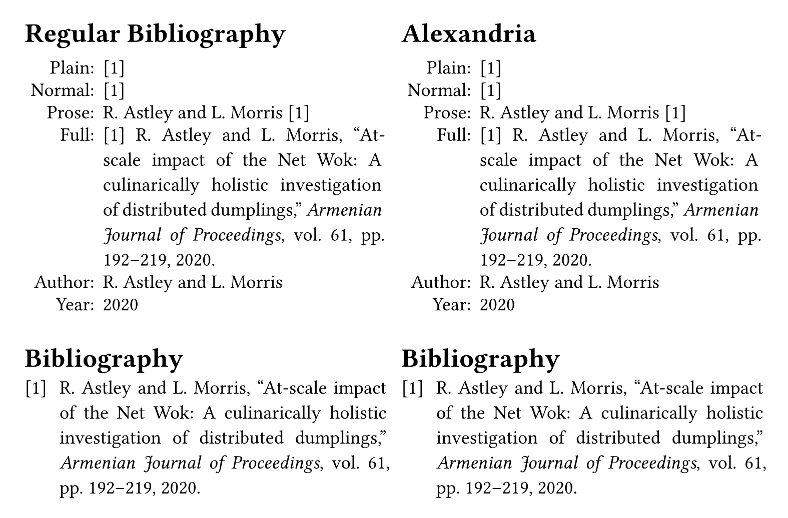

# Alexandria

This package provides an alternative to the built-in bibliography to allow a single document to have multiple bibliographies.

This package is currently limited to English, full IEEE bibliographies and can't order references or collapse citations yet, but more general support is planned soon.

## Getting Started

To add this package to your project, use this:

```typ
#import "@preview/alexandria:0.1.0": *

#show: alexandria(prefix: "x-", read: path => read(path))

...

#bibliographyx(
  "bibliography.bib",
  // title: auto is not yet supported so it needs to be specified
  title: "Bibliography",
  // full: false is not yet supported so it needs to be specified
  full: true,
  // currently, only ieee style is supported, which is the default
  // style: "ieee",
)
```



## Usage

See the [manual](docs/manual.pdf) for details.
